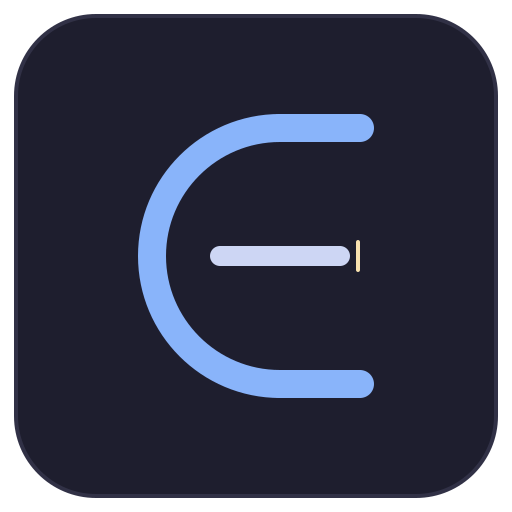

<p align="center">
  
</p>

<h1 align="center">Editora</h1>

<p align="center">
  A desktop CMS for static site generators.<br>
  Edit Markdown, manage frontmatter, preview content - all in one place.
</p>

<p align="center">
  
  
</p>

---

## What is Editora?

Editora is a desktop content editor built for teams and individuals who use static site generators. Instead of editing raw files in a code editor, Editora provides a focused writing environment with live preview, frontmatter management, media handling, and built-in Git support.

Open your project (or clone a Git repo), edit content collections with a split-view Markdown editor, manage media, commit & push changes, and preview your site - all from one app.

### Supported Static Site Generators

| SSG | Status |
|-----|--------|
| Astro | Supported |
| Hugo | Supported |
| Eleventy (11ty) | Supported |
| Jekyll | Supported |
| Next.js | Supported |
| Nuxt Content | Supported |
| Gatsby | Supported |
| VitePress | Supported |
| Gridsome | Supported |
| Hexo | Supported |

## Features

- **Split Editor + Preview** - Write Markdown on the left, see rendered output on the right
- **Frontmatter Editor** - Visual form for editing YAML frontmatter fields (text, dates, tags, booleans, numbers)
- **Media Gallery** - Browse, upload, and manage images within your project. Insert into editor with one click
- **Built-in Git** - Stage, commit, push, and pull without leaving the editor
- **Dev Server** - Start your SSG dev server and see terminal output in-app
- **Auto-detection** - Detects your SSG and content directories automatically
- **Keyboard Shortcuts** - Standard shortcuts for save, find, preview toggle, and more
- **Cross-platform** - Builds for macOS (.dmg), Windows (.exe), and Linux (.deb)

## Installation

Download the latest release for your platform from the [Releases page](https://github.com/MrGKanev/Editora/releases).

| Platform | File |
|----------|------|
| macOS | `.dmg` |
| Windows | `.exe` |
| Linux | `.deb` |

### macOS: "damaged and can't be opened"

Editora is not yet signed with an Apple Developer certificate, so macOS Gatekeeper may show this warning when you first open it. It is **not** actually damaged.

**Option 1 — Right-click to open (easiest):**
1. Right-click (or Control-click) `Editora.app`
2. Select **Open** from the menu
3. Click **Open** in the dialog that appears
4. macOS remembers this choice — future launches work normally

**Option 2 — Terminal command:**
```bash
xattr -rd com.apple.quarantine /Applications/Editora.app
```
Run this once after moving the app to `/Applications`, then open it normally.

## Getting Started

### Prerequisites

- [Node.js](https://nodejs.org/) 18+
- [Git](https://git-scm.com/) (for Git features)

### Install & Run

```bash
git clone https://github.com/MrGKanev/Editora.git
cd Editora
npm install
npm start
```

This launches the Electron app in development mode with hot reload.

### Build for Production

```bash
# Package the app (without installers)
npm run package

# Create platform-specific installers
npm run make
```

Installers are output to the `out/make/` directory.

## Usage

1. **Open a project** - Click "Open Project" and select a folder, or clone a Git repo directly
2. **Browse collections** - The sidebar auto-discovers content collections. Click a file to open it
3. **Edit content** - Markdown on the left, live preview on the right. Use the floating toolbar for formatting
4. **Frontmatter** - Click the "Frontmatter" button to edit metadata fields visually
5. **Save** - `Cmd+S` / `Ctrl+S` saves the file. Use `Save As` to export to a new location
6. **Manage media** - Switch to the Media tab to browse, upload, or insert images
7. **Commit & push** - Switch to the Git tab, write a commit message, and push
8. **Preview** - Switch to the Preview tab and start the dev server

## Keyboard Shortcuts

| Action | macOS | Windows / Linux |
|--------|-------|-----------------|
| Save | `Cmd+S` | `Ctrl+S` |
| Save As | `Cmd+Shift+S` | `Ctrl+Shift+S` |
| New File | `Cmd+N` | `Ctrl+N` |
| Open Project | `Cmd+O` | `Ctrl+O` |
| Toggle Preview | `Cmd+P` | `Ctrl+P` |
| Toggle Sidebar | `Cmd+B` | `Ctrl+B` |
| Toggle Terminal | `` Cmd+` `` | `` Ctrl+` `` |
| Reveal in Finder | `Cmd+Shift+R` | `Ctrl+Shift+R` |

## Tech Stack

| Layer | Technology |
|-------|-----------|
| Desktop runtime | Electron |
| UI framework | React 19 |
| Language | TypeScript |
| Markdown editor | CodeMirror 6 |
| Markdown preview | react-markdown + remark-gfm |
| Frontmatter | gray-matter |
| State management | Zustand |
| Git operations | simple-git |
| Styling | Tailwind CSS 4 (Catppuccin Mocha theme) |
| Build tooling | Electron Forge + Vite |

## License

MIT
